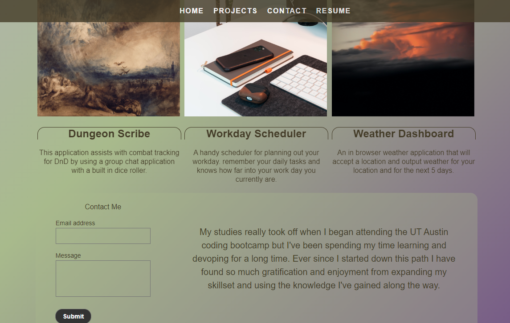

# My Portfolio Website

## Table of Contents
The following readme contains these sections:

* [Usage](#Usage)
* [Live-Link](#Live-Link)
* [License](#License)

## Usage

[My Portfolio](https://joey-sisk.github.io/) page is meant to be an evolving often updated representation and advertisement for my services and abilitys as a webdesigner and developer. The page should include links to my deployed projects in an asthetic way and be built using best practices so that an employer would know that I would be bringing those positive habits with me if they were to hire me. This website should also show that I have a strong understanding of modern web design fundimentals like an adaptive layout that is intuitive and adapts to any sreen size. 

## Live-Link

[You can find a link to the live site here.](https://joey-sisk.github.io/)

## License

There is not currently a license for this service as it is only a homework assignment for the UT Coding Bootcamp Class 2020-2021
